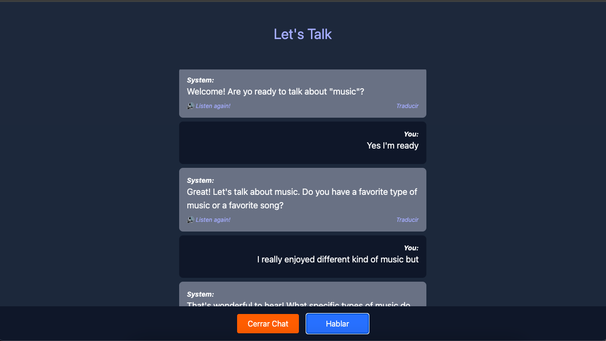

# 🗣️ Let's Talk - App de práctica de inglés conversacional con IA

¡Bienvenido a Let’s Talk! Esta es una aplicación web full-stack diseñada para ayudarte a mejorar tu inglés conversacional mediante interacciones con una inteligencia artificial.

## 🌟 Descripción del proyecto

Let’s Talk simula conversaciones reales en inglés con un asistente virtual impulsado por la API de OpenAI. Los usuarios pueden registrarse, seleccionar un tema, interactuar con la IA y mejorar su fluidez de manera práctica y dinámica.

> ⚠️ Esta es una versión educativa y de demostración. Actualmente estoy trabajando en una versión comercial con funcionalidades premium.

## 🚀 Funcionalidades

- Registro e inicio de sesión de usuarios con autenticación JWT
- Lista de temas conversacionales predefinidos
- Chat interactivo impulsado por OpenAI (GPT)
- Historial de conversaciones por usuario
- Diseño responsivo y accesible
- Conexión con base de datos MongoDB

## 🛠️ Tecnologías utilizadas

### Frontend
- React
- Vite
- Tailwind CSS

### Backend
- Node.js
- Express
- MongoDB
- JWT (Json Web Token)

### IA
- OpenAI API (GPT 3.5/4)

## 📷 Capturas de pantalla




## 📦 Instalación local

```bash
# Clona el repositorio
git clone https://github.com/manpenap/chat-app.git
cd chat-app

# Instala dependencias para frontend y backend
cd client
npm install
cd ../server
npm install

# Configura las variables de entorno (.env)
# Ejemplo:
# OPENAI_API_KEY=tu_clave
# MONGODB_URI=tu_uri
# JWT_SECRET=secreto

# Ejecuta ambos entornos
# Usa herramientas como concurrently o ejecuta cada uno en terminales separadas
```
## 📄 Licencia

Este proyecto está bajo la licencia Apache 2.0. Puedes utilizar el código con fines educativos y de aprendizaje. No está permitida su redistribución comercial sin autorización.

## 🙋 Sobre el autor

Manuel Peña – Portafolio
Desarrollador Web Junior con enfoque en Inteligencia Artificial
Participante del programa Oracle Next Education (Fase 3: Backend + IA)
📧 manpenap@gmail.com | [LinkedIn] (https://www.linkedin.com/in/manuel-alejandro-pena/)